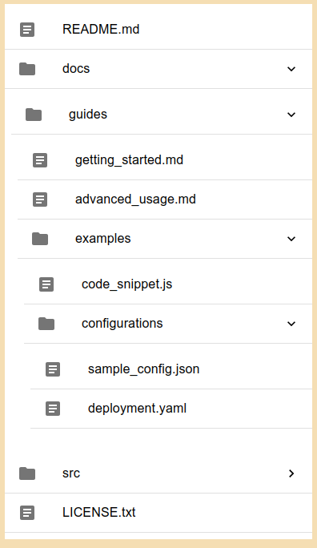

# React Tree Manager

[](https://www.npmjs.com/package/react-tree-manager)


 **⚠️ In development ⚠️**


## Installation

In the project directory, you can run:

`npm install react-tree-manager` or `yarn add react-tree-manager`


## Imports: 


```ts
interface TreeNode {
    children?: TreeNode[];
    path: string;
    type: 'blob' | 'tree';
}
```

`TreeViewer` : React Component - MUI5 based expandable list

`TreeManager` : TS Class for tree/node management, (sample methods: `traverse`,`add`,`remove` etc)

## Usage

#### Pre-render tree manipulaton

```tsx

import * as React from 'react';
import { useEffect, useState } from 'react';
import {Box} from '@mui/material';

import {TreeViewer, TreeManager, type  TreeManagerInstance } from 'react-tree-manager'


type TreeViewComponentProps = {
    tree: TreeNode[];
};
  


 const TreeViewWrapper = (props:TreeViewComponentProps)=> {
  const onSelect = (node: TreeNode) =>  console.log('TreeViewWrapper.onSelect called', node.path);
  const treeManager = new TreeManager(props.tree);


  // pre-render tree manupulation here:

  useEffect(() => {
    console.log('[TreeViewWrapper.useEffect] tree updated', props.tree);
    let cnt = 0;
    treeManager.traverse((node) => {
      console.log(`[TreeManager.traverse][${cnt+=1}] ${node.type} -- ${node.path}`);
    });

  }, [props.tree]);


  return  (
    <Box
        sx={{
          display: 'flex',
          flexDirection: 'column',
          background: 'wheat',
          height: '100%',
          maxWidth: 400,
          minHeight: 800,
        }}
      >
        <Box
          component={'div'}
          sx={{
            display: 'flex',
            flexDirection: 'column',
            height: '100%',
            whiteSpace:"wrap",
            p: 1,
          }}
        >
            <TreeViewer onSelect={onSelect} folder={props.tree} expanded={false} />
        </Box>
      </Box>
  )
  
 }

export {TreeViewWrapper}
```


#### example tree
```json
const sampleTree: TreeNode[]  = [
	{
	  "type": "blob",
	  "path": "README.md"
	},
	{
	  "type": "tree",
	  "path": "docs",
	  "children": [
		{
		  "type": "tree",
		  "path": "docs/guides",
		  "children": [
			{
			  "type": "blob",
			  "path": "docs/guides/getting_started.md"
			},
			{
			  "type": "blob",
			  "path": "docs/guides/advanced_usage.md"
			},
			{
			  "type": "tree",
			  "path": "docs/guides/examples",
			  "children": [
				{
				  "type": "blob",
				  "path": "docs/guides/examples/code_snippet.js"
				},
				{
				  "type": "tree",
				  "path": "docs/guides/examples/configurations",
				  "children": [
					{
					  "type": "blob",
					  "path": "docs/guides/examples/configurations/sample_config.json"
					},
					{
					  "type": "blob",
					  "path": "docs/guides/examples/configurations/deployment.yaml"
					}
				  ]
				}
			  ]
			}
		  ]
		}
	  ]
	},
	{
	  "type": "tree",
	  "path": "src",
	  "children": [
		{
		  "type": "blob",
		  "path": "src/index.js"
		},
		{
		  "type": "tree",
		  "path": "src/components",
		  "children": [
			{
			  "type": "blob",
			  "path": "src/components/Header.jsx"
			},
			{
			  "type": "tree",
			  "path": "src/components/ui",
			  "children": [
				{
				  "type": "blob",
				  "path": "src/components/ui/Button.tsx"
				},
				{
				  "type": "blob",
				  "path": "src/components/ui/Modal.tsx"
				}
			  ]
			}
		  ]
		}
	  ]
	},
	{
	  "type": "blob",
	  "path": "LICENSE.txt"
	}
  ];
  
```

## Credits
* [Create React App](https://github.com/facebook/create-react-app) - react app bootstrapping
* [MaterialUI](https://mui.com/material-ui/getting-started/) - MUIv5 as UI lib
* [StoryBook](https://storybook.js.org/) - for isolated component development and testing
* [Rollup](https://rollupjs.org/) - as component builder
* [XState](https://xstate.js.org/) - state management


