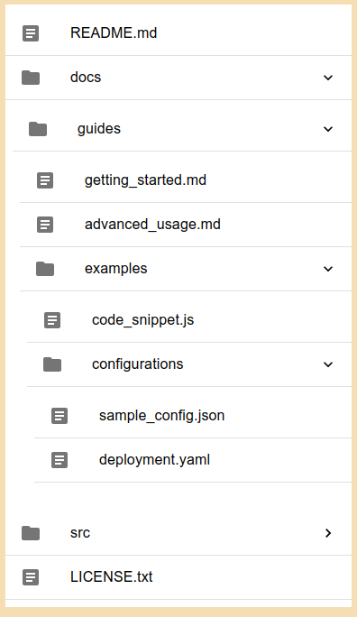

# React Tree Manager

[](https://www.npmjs.com/package/react-tree-manager)


 **⚠️ In development ⚠️**


## Installation

In the project directory, you can run:

`npm install react-tree-manager` or `yarn add react-tree-manager`


## Imports: 

TreeManager is class-generic over the node shape. The default `TreeNode` (the legacy `{ path, type, children? }` blob/tree shape) is exported for backward compatibility, but new code is encouraged to parameterise `TreeManager` over its own node type:

```ts
import {
  TreeManager,
  // helpers added in 0.13.0:
  // type TreeManagerOptions,
  // type DefaultTreeNode,
  type TreeNode, // legacy type, kept for compat
} from 'react-tree-manager'

// Custom domain node, parameterised over its own shape:
type MyCategory = {
  id: string
  name: string
  children?: MyCategory[]
}

const ids = new TreeManager<MyCategory>(myTree)
  .collectIds('id', { includeRoot: true })
//   => string[]

const found = new TreeManager<MyCategory>(myTree)
  .findBy((n) => n.id === 'abc')
//   => MyCategory | null

const path = new TreeManager<MyCategory>(myTree)
  .getPath((n) => n.id === 'xyz')
//   => MyCategory[] | null (chain root → matched)
```

`TreeViewer` : React Component — MUI based expandable list. Optional props `renderLabel(node)` and `getDataTestId(node, depth)` make it usable outside `/`-path domains and with per-node test ids — see the source JSDoc for details.

`TreeManager` : TS Class for tree/node management. `traverse` (DFS, parent before children, declaration order — locked-in contract since 0.12.0) plus the helpers added in 0.13.0: `toArray`, `collectIds<K>(idKey)`, `findBy(predicate)`, `getPath(predicate)`. The other would-be helpers (`add`, `delete`, `move`) are intentionally stubbed — wired up but not mutating the tree. See `CHANGELOG.md` for the stability matrix.

## Usage

#### Pre-render tree manipulaton

```tsx

import * as React from 'react';
import { useEffect, useState } from 'react';
import {Box} from '@mui/material';

import {TreeViewer, TreeManager, type  TreeManagerInstance } from 'react-tree-manager'


type TreeViewComponentProps = {
    tree: TreeNode[];
};
  


 const TreeViewWrapper = (props:TreeViewComponentProps)=> {
  const onSelect = (node: TreeNode) =>  console.log('TreeViewWrapper.onSelect called', node.path);
  const treeManager = new TreeManager(props.tree);


  // pre-render tree manupulation here:

  useEffect(() => {
    console.log('[TreeViewWrapper.useEffect] tree updated', props.tree);
    let cnt = 0;
    treeManager.traverse((node) => {
      console.log(`[TreeManager.traverse][${cnt+=1}] ${node.type} -- ${node.path}`);
    });

  }, [props.tree]);


  return  (
    <Box
        sx={{
          display: 'flex',
          flexDirection: 'column',
          background: 'wheat',
          height: '100%',
          maxWidth: 400,
          minHeight: 800,
        }}
      >
        <Box
          component={'div'}
          sx={{
            display: 'flex',
            flexDirection: 'column',
            height: '100%',
            whiteSpace:"wrap",
            p: 1,
          }}
        >
            <TreeViewer onSelect={onSelect} folder={props.tree} expanded={false} />
        </Box>
      </Box>
  )
  
 }

export {TreeViewWrapper}
```


#### example tree
```json
const sampleTree: TreeNode[]  = [
	{
	  "type": "blob",
	  "path": "README.md"
	},
	{
	  "type": "tree",
	  "path": "docs",
	  "children": [
		{
		  "type": "tree",
		  "path": "docs/guides",
		  "children": [
			{
			  "type": "blob",
			  "path": "docs/guides/getting_started.md"
			},
			{
			  "type": "blob",
			  "path": "docs/guides/advanced_usage.md"
			},
			{
			  "type": "tree",
			  "path": "docs/guides/examples",
			  "children": [
				{
				  "type": "blob",
				  "path": "docs/guides/examples/code_snippet.js"
				},
				{
				  "type": "tree",
				  "path": "docs/guides/examples/configurations",
				  "children": [
					{
					  "type": "blob",
					  "path": "docs/guides/examples/configurations/sample_config.json"
					},
					{
					  "type": "blob",
					  "path": "docs/guides/examples/configurations/deployment.yaml"
					}
				  ]
				}
			  ]
			}
		  ]
		}
	  ]
	},
	{
	  "type": "tree",
	  "path": "src",
	  "children": [
		{
		  "type": "blob",
		  "path": "src/index.js"
		},
		{
		  "type": "tree",
		  "path": "src/components",
		  "children": [
			{
			  "type": "blob",
			  "path": "src/components/Header.jsx"
			},
			{
			  "type": "tree",
			  "path": "src/components/ui",
			  "children": [
				{
				  "type": "blob",
				  "path": "src/components/ui/Button.tsx"
				},
				{
				  "type": "blob",
				  "path": "src/components/ui/Modal.tsx"
				}
			  ]
			}
		  ]
		}
	  ]
	},
	{
	  "type": "blob",
	  "path": "LICENSE.txt"
	}
  ];
  
```

## Credits
* [Create React App](https://github.com/facebook/create-react-app) - react app bootstrapping
* [MaterialUI](https://mui.com/material-ui/getting-started/) - MUIv5 as UI lib
* [StoryBook](https://storybook.js.org/) - for isolated component development and testing
* [Rollup](https://rollupjs.org/) - as component builder
* [XState](https://xstate.js.org/) - state management


##### updated 0619261454